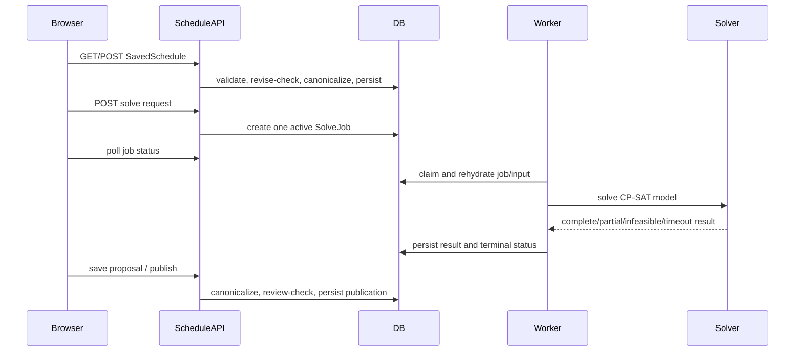

# Feature Context: Admission Scheduler

## 1. Executive summary

**Confirmed:** The admission scheduler is an admission-wide workflow at `/:admissionSlug/schedule`. It stores one canonical `SavedSchedule` per admission, gathers interviewer availability and candidate conflicts, queues an administrator-only OR-Tools CP-SAT solve as a `SolveJob`, lets administrators edit and lock the result, and publishes it by setting `is_distributed=true`.

**Confirmed:** The current checkout is branch `distribute-interviews`, not `master` or a deployed environment. It has extensive uncommitted changes, including most of the newer scheduler workflow and privacy model. Claims below describe the active working tree and distinguish repository guidance from code evidence where relevant.

The likely change boundary depends on the requested behavior: configuration belongs in `schedule_workflow.py` and `AdminScheduleConfig*`; solving belongs in `solve_schedule.py`, `solve_views.py`, `solve_jobs.py`, and the solver UI; publication and row visibility belong in `schedule_validation.py`, `schedule_workflow.py`, `admission_access.py`, and distributed-plan components. The decisive constraints are revision checks, server-side rehydration/canonicalization, omission of unauthorized rows, locked-row preservation, and the difference between an unpublished draft and a published plan.

**Evidence boundary:** Local browser, API, worker, and test evidence can establish release-candidate behavior, but it does not prove a deployed worker, production migrations, observability, or rollback. The checkout also contains an explicitly synthetic solver-input path controlled by settings, so local/demo behavior must not be assumed to match production.

## Scheduler design principles

1. **One canonical object.** `SavedSchedule` is the durable interview plan. Solve jobs, proposals, repair, comparison, manual edits, and publication operate around that object rather than creating parallel plans.
2. **One visible next decision.** Each state should say what the user is seeing, whether there is a real blocker, and the single next action. At most one action is visually primary.
3. **Temporary tasks around a permanent canvas.** Once a draft exists, keep it visible while generation, repair, comparison, candidate control, or manual editing becomes a focused temporary task.
4. **Server authority and least disclosure.** The server decides authorization, candidate scope, validity, proposal applicability, and publication readiness. Sensitive rows must be omitted, not merely hidden.
5. **Provisional is not committed.** Current draft, pending proposal, stale proposal, and published plan are distinct states in both behavior and copy.
6. **Hard constraints stay hard.** Conflicts, unavailable time, required rules, and unsupported preferences must never be softened into misleading warnings or optimization language.
7. **Preserve human intent.** Manual locks survive automation; a solve may work around them but never silently override them.
8. **Progressive disclosure.** Common actions remain immediate. Advanced rules, diagnostics, fine slot editing, and solver explanations stay contextual without becoming inaccessible.
9. **Quiet success, explicit blockers.** Healthy state is calm. A blocker appears once, names the affected subject and constraint, and offers a safe correction or recovery path.
10. **Actionable grids.** Scheduling grids emphasize selectable blocks and assignments. Pauses, healthy diagnostics, and passive metadata receive less visual weight.
11. **Recovery over silent failure.** Stale, failed, destructive, or incomplete operations state what remains authoritative, what did not change, and what the user can do next.
12. **Accessibility is a component contract.** Keyboard and touch operation, visible focus, semantic names, reduced motion, 200% zoom, and responsive behavior are enforced by shared components and acceptance tests.
13. **Reuse before abstraction.** Extend a matching local primitive before adding a generic helper or copying behavior.
14. **Cohesion before line count.** Split files by responsibility and domain boundary, not to satisfy an arbitrary size target.
15. **Domain facts and presentation state stay separate.** Persist schedule lifecycle, job state, proposal freshness, review, conflict, and save state independently; derive the dominant message and action through selectors.

## 2. Requested feature or problem

The current request is a production-readiness review and implementation pass for
the complete admission scheduler. It covers functional correctness, privacy and
authorization, async and stale-response behavior, draft/proposal/publication
state, recovery, mobile and 200% zoom behavior, keyboard/focus/reduced-motion
behavior, maintainability, and release evidence.

**Explicit requirement:** Inspect the real working tree, repair material issues,
exercise the backend and browser paths, and state precisely what local evidence
does and does not prove before push or deployment.

**Release requirement:** Preserve one canonical saved schedule, keep a valid
draft visible behind temporary tasks, allow only one dominant next action,
retain manual locks, enforce sensitive scope on the server, and make failure or
stale state recoverable without silently accepting an unsafe transition.

The review treats the scheduler as the full workflow rather than only the
OR-Tools model: admission access, configuration, availability, conflict review,
proposal generation, draft persistence and editing, repair, publication,
disclosure, export, and interview follow-up are all in scope.

**Distinct subsystems not to conflate:** admission creation/application review; interviewer availability; conflict review; solver proposal generation; manual plan editing; publication/name disclosure; interview follow-up status and outreach. Interview status is stored on the admission-wide application and is adjacent to, but not the same as, schedule placement.

## 3. Project and architecture context

The project is a Django + Django REST Framework backend with a React/TypeScript frontend and Cypress/browser tests. The solver uses OR-Tools CP-SAT. Schedule mutations use session authentication, DRF permissions, scoped throttling, database transactions, and optimistic revision checks.

Relevant map:

```text
admissions/admissions/models.py              persistence entities
admissions/admissions/schedule_views.py      SavedSchedule HTTP adapter
admissions/admissions/schedule_workflow.py   transactional schedule state machine
admissions/admissions/schedule_validation.py  canonicalization and invariants
admissions/admissions/solve_views.py         enqueue/status/cancel HTTP adapters
admissions/admissions/solve_jobs.py          queue request construction/lifecycle
admissions/admissions/solve_schedule.py      CP-SAT model and objective
admissions/utils/management/.../run_solver_worker.py  worker loop
admissions/admissions/admission_access.py    role and response-scope policy
frontend/src/routes/SchedulePage/             workflow shell and published plan
frontend/src/components/Scheduling/            config, availability, solver views
cypress/e2e/*schedule* and *interview_plan*   browser acceptance coverage
admissions/admissions/tests/test_*schedule*   API, solver, worker, privacy coverage
```

`CONTEXT.md` is the normative compact domain guide. `ADMISSIONS_AI_CONTEXT.md` describes a working tree on `distribute-interviews`, including uncommitted work; code and tests are the current evidence for behavior.

## 4. Current user and system behavior

### Actors and entry

Admission administrators are active `leader` or `recruiting` members of an admission’s `admin_groups`. Recruiters are active `leader`/`recruiting` members of participating groups. Ordinary active committee members can submit their own availability and, after publication and disclosure, see authorized interviews. Only administrators can configure, solve, inspect solve jobs, edit the complete schedule, publish/unpublish, or export admission-wide scheduling data.

The frontend route is `/:admissionSlug/schedule`; the backend schedule endpoint is `/admin/admission/<admission_slug>/schedule/`. The workflow stepper is role-sensitive: members see availability and plan surfaces; administrators also see configuration, coverage, solver, and publication controls.

### Configuration

Administrators set `start_date`, optional `end_date`, `day_start_minute`, `day_end_minute`, `session_duration`, `enabled_windows` (with legacy `enabled_slots` compatibility), `chunk_size`, `chunk_break_minutes`, `panel_size`, and solver options. Windows are normalized to canonical contiguous intervals and derived slot keys. The period and slot counts are bounded by constants.

Changing the grid or block shape clears an existing plan when the request did not explicitly provide a replacement, unpublishes it, and removes availability that no longer matches the grid. A new schedule write requires `expected_updated_at=null`; an update requires the exact server revision. Stale or missing revisions return `409` rather than last-writer-wins behavior.

### Availability and conflicts

`InterviewAvailability` is unique per `(admission,user)` and stores selected slots, candidate conflict IDs, and reviewed candidate IDs. The UI includes participant availability editing, an administrator heatmap/coverage surface, and conflict review for proposed assignments. A participant’s conflicts are hard solver exclusions, not just visual annotations.

### Solving and proposal review

The administrator starts a solve from the solver setup surface. The request is validated and canonicalized against database candidates, interviewers, availability, conflicts, schedule configuration, and locked assignments. The HTTP request enqueues a job and returns immediately; the frontend polls job status. The result can be `SUCCESS`, `PARTIAL`, `INFEASIBLE`, `TIMEOUT`, `ERROR`, or a locked-conflict result from validation/worker handling. Partial results include unplaceable candidates and reasons.

The solver maximizes placement first. Secondary behavior includes overtime penalties, interviewer load balancing, earliness/continuity preferences, same-gender coverage when enabled, same-panel-per-block behavior for initial planning, and repair profiles (`minimum_change`, `preserve_panels`, `balanced`) when a previous schedule is supplied. Locked rows are pinned across reruns. Manual assignment marks a row as manual and locks it.

### Publication and follow-up

An unpublished schedule is a draft visible to administrators. A changed published schedule automatically unpublishes unless explicitly published again. Publishing an empty plan is rejected; publication canonicalization requires all active candidates to be scheduled and checks conflicts, panel size, valid times, interviewer identity, availability/overtime, gender, and block consistency.

Publishing opens the committee-facing plan. Candidate identity is separately controlled by `name_visibility` and `revealed_groups`; disclosure is audited. ICS export is anonymized, while CSV and schedule rows are scoped to the requesting user. Email/SMS actions open browser drafts; they do not send messages or persist templates server-side. Interview status updates are a separate optimistic-concurrency workflow on `UserApplication`.

## 5. End-to-end execution flow

1. An authenticated user enters `/:admissionSlug/schedule`; the frontend loads admission context, the saved schedule, participant/availability data, and role-sensitive workflow state.
2. An administrator saves configuration through the schedule mutation. `SavedScheduleView.post` validates `SaveScheduleInputSerializer`, calls `update_saved_schedule`, locks the admission/schedule path transactionally, normalizes windows/slots, checks `expected_updated_at`, canonicalizes any supplied rows, and persists one `SavedSchedule`.
3. Participants submit availability and conflicts through the availability APIs. Access is scoped by represented committee, admin role, or current-user ownership.
4. The administrator opens coverage and solver setup. The client builds solver options and locked assignments from the current draft, including `baseline_updated_at` for repair/re-solve protection.
5. `SolveScheduleView.post` verifies administrator access, validates `ScheduleRequestsSerializer`, locks the admission, rejects a missing saved configuration, rejects a stale baseline when supplied, and canonicalizes non-synthetic input from database state.
6. `enqueue_solve_job` creates one pending `SolveJob` per admission. A partial unique database constraint and an `IntegrityError` fallback make concurrent enqueue requests converge on the existing active job.
7. `run_solver_worker` claims pending jobs, rehydrates candidates/interviewers and current availability for non-synthetic jobs, calls `solve_schedule`, stores result/error/status timestamps, and releases the active-job slot on completion/failure/cancellation.
8. The frontend polls `SolveJobStatusView`, displays progress/error/partial/unplaceable/optimality state, and holds the solve result as a draft until the administrator explicitly persists it.
9. Manual row edits, time changes, panel changes, and lock/unlock operations update the draft. Manual changes are represented independently from `interview_status` and normally retain ownership across future solves.
10. The administrator persists the proposal. `schedule_workflow` re-canonicalizes it and opens assignment conflict review while it remains unpublished.
11. Participants review assigned candidates/conflicts where authorized. Publication is rejected until required review is complete and all candidates are placed.
12. The administrator publishes. `is_distributed` becomes true, disclosure controls become eligible, and committee users receive only rows in their authorization scope. Unpublishing hides draft rows from ordinary committee users.
13. After publication, authorized users can view filtered table/calendar/person plans, export scoped artifacts, open outreach drafts, and update admission-wide interview status with its own revision/audit workflow.



## 6. Relevant files and symbols

| File | Symbol or section | Role | Why it matters |
| --- | --- | --- | --- |
| `admissions/admissions/models.py:257-470` | `SavedSchedule`, `InterviewAvailability`, `SolveJob` | Persistence | Canonical schedule/config, participant state, async queue and uniqueness constraint. |
| `admissions/admissions/schedule_views.py:30-135` | `SavedScheduleView` | HTTP adapter | Auth, throttling, revision-aware read/write path. |
| `admissions/admissions/schedule_workflow.py:57-535` | `update_saved_schedule` and helpers | State machine | Window normalization, grid-change clearing, publication/review transitions, transaction. |
| `admissions/admissions/schedule_validation.py:92-400` | canonicalizers | Server authority | Rehydrates names/IDs and enforces schedule invariants. |
| `admissions/admissions/solve_views.py:34-220` | solve/status/cancel views | Async API | Admin gate, baseline check, enqueue, polling and cancellation. |
| `admissions/admissions/solve_jobs.py:7-79` | queue helpers | Queue contract | Request shape and one-active-job behavior. |
| `admissions/admissions/solve_schedule.py:1-704` | solver model | Optimization | Constraints, objectives, repair strategies, result statuses. |
| `admissions/utils/management/commands/run_solver_worker.py` | `Command` | Worker | Claims and executes jobs outside HTTP. |
| `admissions/admissions/admission_access.py` | schedule response/access helpers | Privacy | Admission admin, recruiter/member scope, row omission and disclosure. |
| `admissions/admissions/serializers.py:685-1060` | schedule/job/input serializers | Contract validation | Response shape and bounded input fields. |
| `frontend/src/routes/SchedulePage/index.tsx` | route shell | UI entry | Selects workflow mode, role surfaces, and data loading. |
| `frontend/src/routes/SchedulePage/workflowSteps.ts` | workflow definitions | UI state | Distinguishes foundation, proposal, publication/execution. |
| `frontend/src/components/Scheduling/Calendar/AdminScheduleConfig.tsx` | admin config | UI | Date/grid/block configuration. |
| `frontend/src/components/Scheduling/Solver/SolverSetupPanel.tsx` | solve setup | UI | Options, rerun, lock continuity, repair entry. |
| `frontend/src/components/Scheduling/Solver/SolverResults.tsx` | proposal views | UI | List/calendar/person results and partial/error states. |
| `frontend/src/routes/SchedulePage/DistributedPlanView.tsx` | published plan | UI | Scoped plan projections, disclosure, export, outreach and unlock flow. |
| `frontend/src/routes/SchedulePage/useDistributedPlanActions.ts` | plan mutations | UI/API bridge | Publish, edit, visibility, export and row operations. |
| `cypress/e2e/interview_plan_workflow_spec.cy.ts` | workflow specs | Acceptance | Confirms visible step separation, coverage and publication controls. |
| `admissions/admissions/tests/test_schedule_api_hardening.py` | schedule hardening tests | Backend regression | Revision, publication, conflict review and canonicalization behavior. |
| `admissions/admissions/tests/test_api.py` | API/solver tests | Backend regression | Locked assignment preservation and solve/job behavior. |

## 7. Data model and state

`Admission` owns participating `Group`s and administrator groups. `UserApplication` is one candidate application per admission; its group applications can be multiple, but interview placement and `interview_status` are admission-wide. `SavedSchedule` is a one-to-one admission object. Its `schedule` JSON contains rows shaped approximately as:

```json
{
  "candidate_id": "application-uuid",
  "candidate": "server-resolved display name",
  "time": 600,
  "panel": [{"id": "user-uuid", "name": "server-resolved name", "is_overtime": false}],
  "locked": true,
  "booking_source": "manual"
}
```

Time is an integer minute representation relative to the schedule start date in solver input/output; frontend utilities encode/decode date and minute keys. Availability stores canonical date/minute slot keys. `enabled_windows` is the preferred persisted representation; `enabled_slots` is derived/compatibility state.

Persisted state: `SavedSchedule`, availability/conflicts, `SolveJob`, disclosure/audit events, and application interview status. Derived/ephemeral state: frontend workflow step, solver polling state, current unsaved draft, coverage visualizations, and browser-local outreach templates. The worker result is not itself the canonical schedule until an administrator saves it.

Important invariants: one active solve job per admission; one schedule per admission; one availability row per participant; candidate appears at most once; one panel member cannot occupy overlapping slots; unknown/stale IDs are rejected; published plans are complete; locked rows remain solver-owned constraints until unlocked; schedule writes are revision-checked.

Authority is split deliberately: the browser proposes IDs/names and draft rows; the backend database and canonicalizer decide whether candidates, interviewers, time slots, conflicts, availability, and disclosure are valid. `SolveJob` owns asynchronous execution state; `SavedSchedule` owns durable plan/config state.

## 8. API and interface contracts

### Saved schedule

`GET /admin/admission/<slug>/schedule/` returns the scoped `SavedSchedule` or `404`; authenticated admission participants may read an authorized projection. `POST` accepts schedule/config fields plus required `expected_updated_at` (null only for first create). Only admission administrators may mutate schedule configuration, rows, publication, or candidate-name visibility; recruiters and committee members receive their server-scoped read projection. Responses include revision metadata, distribution, conflict-review and visibility state, and only authorized rows. Errors include `400` validation, `403` permission, `404` absent schedule/admission, and `409` stale revision.

### Availability and review

Availability endpoints accept the current user’s slots/conflicts or admin-scoped participant actions. They enforce admission/group scope and persist `InterviewAvailability`; conflict review also tracks reviewed candidate IDs and audit snapshots. Exact route declarations are in `admissions/urls.py` and adapters in `availability_views.py`/`candidate_views.py`.

### Solve

`POST /solve-schedule/` accepts `admission_slug`, candidate/interviewer IDs, panel size, options, locked assignments, optional blocks, and optional `baseline_updated_at`. Production-shaped requests set `rehydrate=true` through `build_solve_request`; synthetic candidate/interviewer payloads are only allowed by settings. It returns `202` with a `SolveJob`, returns an existing active job for duplicate/concurrent requests, `400` for invalid input/missing saved config, `403` for non-admins, and `409` for a stale baseline.

`GET` job status returns status, timestamps, result, and error to authorized admission administrators. Cancellation changes an active job to `CANCELLED`; worker claim/execution must tolerate cancellation and exceptions.

### Publication/disclosure

Publication is a `POST` to the saved-schedule endpoint with `is_distributed=true`, not a separate immutable publish entity. It is blocked for empty/incomplete/noncanonical plans or incomplete conflict review. Name visibility is a separate scoped mutation and is audited. Compatibility risk is high if a client treats `is_distributed` as equivalent to identity visibility.

## 9. Existing analogous implementations

The schedule workflow itself is the closest analogous state machine: reuse its revision-aware transactional update pattern for any new durable schedule state. `InterviewStatus` uses a separate optimistic-concurrency/audit workflow; reuse its audit and stale-write discipline, but do not move placement state into it.

The availability heatmap and `AdminAvailabilityGrid` are the nearest UI patterns for slot-grid editing and coverage visualization. They are reusable for interaction conventions, but their participant scope differs from the all-admission admin solver view.

The solver’s warm-start/locked-assignment path is the closest analogous repair mechanism. Reuse `locked_assignments`, `previous_schedule`, `baseline_updated_at`, and explicit repair strategies rather than inventing a second schedule version model.

The distributed plan table/calendar and export helpers are the analogous read-scope surfaces. They demonstrate that unauthorized rows must be filtered at the response/data-selection boundary, not merely hidden in presentation.

## 10. Business rules and constraints

**Confirmed hard constraints:** only admission admins can solve/edit the full plan; one active job per admission; schedule writes use optimistic revision checks; server canonicalization is authoritative; published schedules cannot be empty and must be complete; conflicts, duplicate candidates/times/panel members, unknown IDs, invalid times, self-interviews, same-gender requirements, and same-panel block rules are validated; locked rows survive reruns; unauthorized rows are omitted; disclosure is audited.

**Confirmed implementation conventions:** schedule period is bounded (the configured constant is used by `schedule_workflow`); slot/window counts and payload sizes are bounded; solve work is asynchronous; ICS is anonymized; outreach templates are browser-local.

**Inferred requirements:** changes to a published plan should be treated as a new review/publication step; repair previews should be compared against a specific baseline; user-facing partial results should remain actionable rather than silently discarded.

**Unknown product decisions:** whether publication should be immutable after distribution; whether conflict review should remain assignment-based or become a separate explicit approval model; desired worker retry/backoff and operational ownership; target maximum admission/candidate sizes; whether browser-local outreach templates should become shared durable templates.

## 11. Testing and validation

The release-hardening working tree has outcome coverage across:

- `admissions/admissions/tests/test_schedule_api_hardening.py`: stale revision conflicts, publication/unpublication, empty/incomplete plans, conflict-review readiness, canonicalized names/IDs, gender/panel constraints, and privacy-sensitive schedule behavior.
- `admissions/admissions/tests/test_api.py`: solve endpoint/job behavior and locked assignment preservation/conflicts.
- `admissions/admissions/tests/test_solver_quality.py` and `test_solver_v2.py`: constraint outcomes, v1/v2 validity and proved-optimum semantic comparison, repair locality, permutations, and size/performance behavior.
- `admissions/admissions/tests/test_worker_resilience.py`: cancellation, stale-job recovery, failures, delayed worker results, and authority/baseline guards.
- `admissions/admissions/tests/test_cypress_fixtures.py`: fail-closed fixture enablement, real CSRF login, idempotent seeding, rollback, and administrator verification.
- `cypress/e2e/interview_plan_workflow_spec.cy.ts`, `workflow_steps_model_spec.cy.ts`, and `solver_setup_panel_spec.cy.ts`: workflow stages, readiness, generation/regeneration, progress, blockers, outreach, and publication separation.
- `cypress/e2e/solver_async_race_spec.cy.tsx`,
  `planutkast_drawers_spec.cy.tsx`, and
  `distributed_plan_transition_spec.cy.tsx`: duplicate/late/unmounted async
  work, worker-promoted first-draft reconciliation, apply-time proposal
  conflicts, queue-drained autosave before publication, intermediate-save
  failure, edit/undo/redo coalescing, revision-scoped fingerprinting,
  compensating writes after uncertain failures, stale proposal comparison,
  lost-response reconciliation, focused temporary tasks, and focus
  restoration.
- `cypress/e2e/selectable_schedule_grid_spec.cy.tsx`: native table headers,
  one roving tab stop, row/column navigation, blocked-cell skipping,
  date-bearing admin control names, assistive-technology click activation,
  pointer drag/re-entry, secondary/Control-click rejection, touch pan/tap
  disambiguation, inline opt-out focus on success, cancellation, and failure,
  and stable block/pause editing.
- `cypress/e2e/sensitive_access_model_spec.cy.ts` and `scheduler_release_acceptance_spec.cy.ts`: authority epochs, server-confirmed logout ordering, same-page role recovery, fail-closed scope, recruiter disclosure, keyboard focus, reduced motion, responsive layouts, and release screenshots.

Release validation on 2026-07-24:

- `DATABASE_PORT=5433 poetry run python manage.py test admissions --keepdb -v 1` — 401 tests passed in 135.497 seconds; no system-check issues.
- `poetry run flake8 admissions` — passed.
- `poetry run black --check admissions` — 100 files unchanged.
- `DATABASE_PORT=5433 poetry run python manage.py makemigrations --check --dry-run` — no changes detected.
- `poetry run tox -e isort` — isort, flake8, and Black checks passed.
- `yarn cypress:run --browser electron` — 25/25 specs and 210/210 tests passed
  in 01:57; no failed, pending, or skipped tests.
- Focused reruns passed for proposal apply (9/9), autosave/publication
  transitions (11/11), async races (12/12), selectable-grid accessibility,
  focus, and gesture behavior (26/26), sensitive access (8/8),
  landing/logout (4/4), solver setup (18/18), and interview workflow (7/7).
- `yarn types`, `yarn lint`, `yarn knip`, `yarn build`, and `git diff --check` passed on the final code snapshot; the documentation-only evidence update was followed by another diff check.
- Cypress allows 15 seconds for a lazy authenticated route to emit its first
  intercepted request; response and assertion behavior retain their existing
  limits. This removes a reproduced cold-route harness flake without masking
  slow or incorrect responses.
- Sixteen browser screenshots cover foundation fine-tuning, first solve and
  regeneration settings, manual draft editing, candidate review, repair
  preview, stale-proposal comparison, publication readiness, the published
  workflow at 390, 768, and 1280 pixels, a 200-percent CDP page-scale check,
  and four standard-block/pause configurations. The final set is archived at
  `/Users/viljen/.codex/visualizations/2026/07/23/019f90eb-7cbd-7852-bbf5-8bbef8afa20f/admissions-scheduler-release-evidence-final-2026-07-24`.

The first full backend run exposed a resource-sensitive differential assertion:
a one-second v2 feasible incumbent was compared with a v1 optimum as though both
were proved optima. Direct seed-109 reproduction was optimal and stable across
30 runs. The test now preserves unconditional validity, placement, and reason
parity, gives the tiny cases a five-second ceiling, and compares objective keys
only when v2 explicitly reports `optimal=true`; the focused and full backend
suites then passed.

Still outside local proof: a deployed production worker and queue restart,
production migration/rollback execution, live LEGO membership revocation
without a subsequent request, native assistive-technology traversal, native
browser zoom rather than the automated page-scale/responsive proxies, and
production-scale latency/observability. These are deployment or manual
acceptance boundaries, not claims made by the local suite.

## 12. Performance, security, and operational considerations

CP-SAT complexity grows with candidates × slots × interviewer assignments; bounds, solver timeouts, and a worker keep heavy work out of HTTP. The schedule and availability JSON fields can become large; query and payload limits are therefore material. A single active job prevents duplicate concurrent solves but also serializes solving per admission.

Revision checks protect schedule writes and baseline checks protect repair solves. The unique active-job constraint protects queue consistency. Worker retry semantics, orphaned `RUNNING` recovery, and durable result retention require runtime verification.

Authorization is high risk: candidate identity, time, panel, row count, exports, conflict data, and disclosure state are sensitive. Backend scope filtering is mandatory; frontend hiding is not authorization. Session cache invalidation code also blocks sensitive delayed writes after access failures.

Accessibility and responsive behavior are enforced at the shared scheduling
primitives and focused task boundaries: semantic grids/tables, roving focus,
menu navigation, modal trapping, opener restoration, live saving/solver/error
announcements, colour-independent copy, reduced motion, touch targets, and
390/768/1280 layouts have automated outcome coverage. Those checks establish
DOM semantics and keyboard behavior, but not the quality of a complete
VoiceOver/NVDA traversal. Migration risk remains material because the branch
adds schedule/disclosure/conflict/status migrations and changes JSON contracts.

## 13. Likely change surface

For solver semantics: `solve_schedule.py`, `solve_views.py`, `solve_jobs.py`, worker command, solver serializers/types, `SolverSetupPanel`, `SolverResults`, repair helpers, and solver tests.

For schedule configuration: `schedule_workflow.py`, `schedule_validation.py`, `serializers.py`, `schedule_views.py`, `models.py`/migrations, `AdminScheduleConfig*`, frontend schedule hooks, and configuration/Cypress tests.

For publication/visibility: `schedule_workflow.py`, `admission_access.py`, serializers, distributed-plan components, export helpers, audit models/migrations, privacy tests, and Cypress publication flows.

Stable contracts to preserve are one `SavedSchedule` per admission, revision-aware writes, async `SolveJob`, server-resolved IDs/names, scoped rows, and separate `is_distributed`/name visibility. A new abstraction is justified only if it reduces duplication without creating a second source of truth for plan lifecycle.

## 14. Candidate solution directions

**A. Extend the existing schedule workflow and contracts.** Add the behavior to `schedule_workflow`, canonicalization, and the corresponding UI surface. This best fits current boundaries and preserves revision/publication semantics. Risk: the workflow already has many coupled state transitions; new flags can increase ambiguity.

**B. Add a dedicated proposal/repair domain object.** Persist a solve result or repair scenario separately before applying it to `SavedSchedule`. This improves auditability and preview isolation, but introduces version ownership, cleanup, authorization, and compatibility work. The current `SolveJob.result` plus `baseline_updated_at` may already cover a lightweight version.

**C. Keep the behavior ephemeral in the frontend.** Use the existing solver result/draft state and persist only on explicit save. This is appropriate for preview-only UI changes and minimizes migrations, but cannot support cross-user review, durable approval, or recovery after reload.

**D. Make publication a first-class lifecycle entity.** Useful if the product needs immutable releases, rollback, or release-specific audit/export. It is a larger change and conflicts with the current `SavedSchedule.is_distributed` model unless a migration strategy is explicit.

## 15. Open questions

### Blocking

- Before deployment, verify that every active admission has at least one
  `leader` or `recruiting` member in an explicitly selected admin group. The
  release deliberately no longer grants admission-wide authority to an
  ordinary admin-group member.
- Exercise the production migration, mixed web/worker version window, worker
  restart, observability, and rollback procedure in the target environment.
- Perform a native screen-reader and browser-zoom smoke pass over the critical
  administrator and interviewer journeys. Automated semantics, keyboard,
  page-scale, and responsive checks do not substitute for that manual evidence.

### Important

- What worker deployment, retry, timeout, and stale-`RUNNING` recovery service-level guarantees are required? Repository code cannot prove operational ownership.
- What are the target admission sizes and acceptable solve latency? This determines whether the current CP-SAT model and JSON persistence are sufficient.
- Should a published schedule eventually become an immutable release with
  explicit revision history, or is unlock-edit-republish the intended durable
  policy?
- Should outreach templates be shared and audited, or remain browser-local drafts?

### Optional

- Should administrators be able to inspect immutable solve inputs/results after a schedule is saved?
- Should solver objective weights and repair strategy labels be configurable per admission or remain code-defined?
- What keyboard/mobile acceptance standard is required for dense schedule editing?

## 16. Recommended next investigation steps

1. Review and intentionally commit the dirty working-tree scope; then run the
   same backend, Cypress, and static gates in CI.
2. Audit real admin-group role data before deploying the narrowed authority
   policy.
3. Stage the migration and a mixed-version web/worker rollout; prove claim,
   cancellation, stale-job recovery, logs, metrics, and rollback.
4. Exercise a production-shaped admission through configure → availability →
   solve → partial result → edit/lock → conflict review → publish → scoped
   committee view, including native zoom and assistive technology.
5. Measure solve latency and memory across representative
   candidate/interviewer/slot sizes before changing the v2 rollout flag.
6. Decide whether publication needs immutable release history or whether the
   current revision-checked unlock-edit-republish lifecycle is the product
   contract.

## 17. Evidence appendix

```text
[admissions/admissions/models.py — SavedSchedule, InterviewAvailability, SolveJob]

SavedSchedule is one-to-one with Admission and stores schedule/configuration, distribution, visibility, and review state. InterviewAvailability is unique per admission/user. SolveJob has an admission-scoped conditional unique constraint for PENDING/RUNNING jobs.

Why it matters:
These are the durable authorities and concurrency boundaries for the scheduler.
```

```text
[admissions/admissions/schedule_workflow.py — _ensure_revision_matches, _resolve_schedule_state, _ensure_conflict_review_ready_for_publish]

Missing/stale expected_updated_at raises a revision conflict. Grid changes can clear the plan. Changed schedules unpublish unless explicitly republished. Publication requires conflict-review readiness.

Why it matters:
The schedule is a stateful draft/review/publish workflow, not a stateless solver output.
```

```text
[admissions/admissions/solve_views.py and solve_jobs.py — SolveScheduleView, build_solve_request, enqueue_solve_job]

The endpoint validates admin access, checks saved configuration and baseline revision, canonicalizes non-synthetic input, and returns a queued job. Requests rehydrate IDs server-side; concurrent active jobs converge on one job.

Why it matters:
The browser is not trusted as the source of candidate/interviewer identity or current schedule state.
```

```text
[admissions/admissions/solve_schedule.py — objective and result construction]

Placement dominates secondary objectives. The model supports locked rows, conflicts, availability/overtime, gender coverage, load balancing, continuity, panel blocks, and repair costs. Results distinguish SUCCESS/PARTIAL/INFEASIBLE/TIMEOUT/ERROR and include unplaceable explanations.

Why it matters:
Solver changes must preserve both hard constraints and priority ordering.
```

```text
[CONTEXT.md and ADMISSIONS_AI_CONTEXT.md — scheduler invariants and workflow]

The domain guidance states that unauthorized rows are omitted, identity disclosure is audited and scoped, `SavedSchedule` is canonical, `SolveJob` is asynchronous, and interview status is admission-wide.

Why it matters:
These are explicit architectural constraints, but ADMISSIONS_AI_CONTEXT.md describes a working tree and must not be mistaken for deployed state.
```

## 18. External-model handoff

### What you should assume

- The scheduler is admission-wide and represented by one `SavedSchedule`.
- Solver execution is asynchronous through one active `SolveJob` per admission.
- Server-side canonicalization and authorization are authoritative.
- Draft, published/distributed, and identity-visible are separate concepts.
- Locked/manual rows are intended to survive reruns.

### What you should not assume

- That this uncommitted branch is deployed or matches `master`.
- That a reachable frontend proves worker, migration, authorization, or publication behavior.
- That a solve result is durable until an administrator saves it.
- That `is_distributed=true` means all committee members can see candidate names.
- That browser-local outreach templates are shared product data.

### Decisions you are being asked to make

- Identify the exact scheduler slice to change.
- Decide whether publication is mutable or release-based.
- Decide the required worker/retry/scale guarantees.
- Decide whether conflict review and repair proposals need durable, auditable entities.

### Most relevant evidence

- `admissions/admissions/models.py:257-470`
- `admissions/admissions/schedule_workflow.py:57-535`
- `admissions/admissions/schedule_validation.py:92-400`
- `admissions/admissions/solve_views.py:34-220`
- `admissions/admissions/solve_jobs.py:7-79`
- `admissions/admissions/solve_schedule.py:340-704`
- `frontend/src/routes/SchedulePage/index.tsx`
- `frontend/src/components/Scheduling/Solver/SolverSetupPanel.tsx`
- `frontend/src/components/Scheduling/Solver/SolverResults.tsx`
- `cypress/e2e/interview_plan_workflow_spec.cy.ts`
- `admissions/admissions/tests/test_schedule_api_hardening.py`
