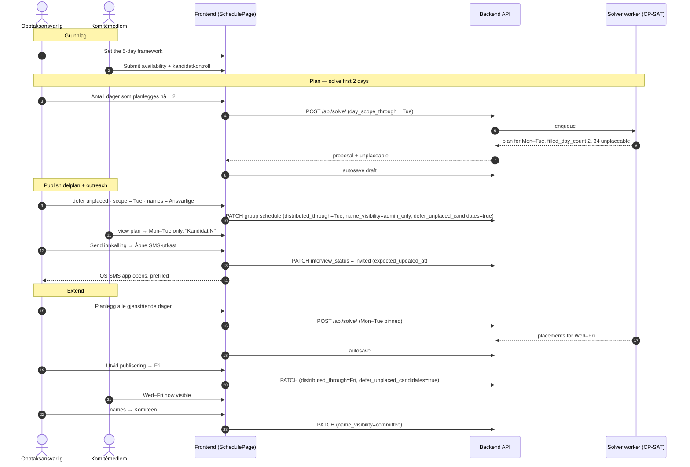
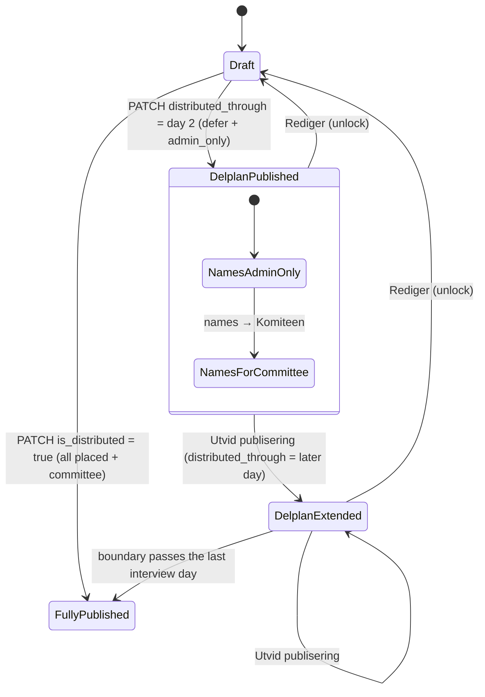

# Progressive Interview Scheduling — Operational & Technical Guide

How Abakus Admissions (**Opptak**) plans, publishes, and follows up interview
schedules **a few days at a time**: solve the first days, publish a partial plan
(**delplan**) to the committee with candidate names limited to the recruiters,
send 1-click SMS invitations that flip the interview status automatically, then
extend both the plan and the publication boundary to the remaining days.

> **Verified against** `92d69e72` (branch `staging`, 2026-08-29).
> This document is tightly coupled to UI strings and API shapes — re-check it
> against the code when either changes. All source links are repo-relative.

---

## Table of Contents

1. [Actors & capabilities](#1-actors--capabilities)
2. [Core concepts & invariants](#2-core-concepts--invariants)
3. [Step 1 — Staged solving: plan the first days](#3-step-1--staged-solving-plan-the-first-days)
4. [Step 2 — Publish the partial plan (Publiseringskrav)](#4-step-2--publish-the-partial-plan-publiseringskrav)
5. [Step 3 — Outreach: restricted names & 1-click messaging](#5-step-3--outreach-restricted-names--1-click-messaging)
6. [Step 4 — Extend the plan and the boundary](#6-step-4--extend-the-plan-and-the-boundary)
7. [Diagrams](#7-diagrams)
8. [Code map & troubleshooting](#8-code-map--troubleshooting)
9. [Producing the screenshots / video for this guide](#9-producing-the-screenshots--video-for-this-guide)

---

## 1. Actors & capabilities

Admissions runs recruitment across several committees (**groups**). Each
participating committee owns one independent schedule ([`SavedSchedule`](../../admissions/admissions/models.py)),
its own interviewers, and its own candidate interviews. Nothing about one
committee's plan is visible to another.

| Actor | Who they are | Scheduling & publication | Candidate visibility |
| :--- | :--- | :--- | :--- |
| **Opptaksansvarlig** (recruiter) | The committee's `leader` or `recruiting` member in LEGO — `canManageSchedule` in [`SchedulePage/index.tsx`](../../frontend/src/routes/SchedulePage/index.tsx#L288) | Full control: set the framework, run the solver, review the draft, publish / extend / unlock, toggle name visibility, edit slot times & panels, run outreach. | **Always** sees real names, phone numbers, interview status and the workflow metadata (who last changed a status, when) for their own committee. |
| **Ordinary committee member** | The committee's `member` in LEGO | Submits **their own availability**, and confirms **their own** inhabilitet review (kandidatkontroll) for pairings they are proposed for. | Before publication: nothing. After a (partial) publish: interviews **up to the published boundary only**, with names shown as **`Kandidat N`** unless the recruiter has set names to `committee`. No phone numbers, no status metadata. |
| **Admission administrator** | Leader/recruiter of an `admin_groups` group on the admission, or a hard-coded god id | Admission-wide oversight; backend `is_interview_admin` also grants the recruiter view of a committee's schedule. | Full candidate data — **except** a group that is itself competing in the admission stays scoped to its own applicants ([permission model](admission-scheduler.md)). |
| **Applicant** | An authenticated student applicant | Applies, views the receipt, receives interview invitations by SMS. | Only their own application and receipt. |

> **Least-disclosure principle.** Members must show up to interviews on time, so
> they see *when* they are assigned. Identities stay hidden behind stable
> pseudonyms (`Kandidat 1`, `Kandidat 2`, …) until a recruiter deliberately
> releases them. The server drops out-of-scope rows and strips names/phones
> **before serialization** (`SavedScheduleSerializer.to_representation`,
> [`serializers/schedule.py`](../../admissions/admissions/serializers/schedule.py#L457-L624)) — it is not a
> frontend blur.

---

## 2. Core concepts & invariants

```
┌──────────────────────────────────────────────────────────────────────────────────┐
│                                  SAVED SCHEDULE                                   │
│                                                                                  │
│  start_date ─────────────────────────────────────────────────────► end_date      │
│  ├─ Mon ──────────┬─ Tue ──────────┬─ Wed ──────────┬─ Thu ─────┬─ Fri ────────┤ │
│  │ solved · locked │ solved · locked │ draft          │ draft     │ draft        │ │
│  └────────────────┴────────────────┴────────────────┴───────────┴──────────────┘ │
│                                    ▲                                             │
│                             distributed_through                                  │
│                          (the publication boundary)                              │
│                                                                                  │
│  • Members see: Mon–Tue only, names as "Kandidat N"                               │
│  • Recruiter draft workspace: Wed–Fri still fully plannable; Mon–Tue frozen       │
│  • name_visibility = admin_only → recruiters see real names + run SMS             │
└──────────────────────────────────────────────────────────────────────────────────┘
```

### 2.1 One canonical record

[`SavedSchedule`](../../admissions/admissions/models.py) holds both the **framework**
(dates, day window, session duration, block/chunk sizing, panel size) and the
**plan** (`schedule` — a JSON list of slot objects). Solver runs, drafts and the
published version all read and write this one row, guarded by optimistic
concurrency (`expected_updated_at`, see [§4.3](#43-the-publish-request)).

### 2.2 Rolling-prefix publication — `distributed_through`

Publication is **not** all-or-nothing. `SavedSchedule.distributed_through` is an
ISO date.

- An interview **on or before** that date is visible to committee members.
- An interview **after** it is dropped server-side for members
  (`publication_boundary` in [`admission_access.py:schedule_response_context`](../../admissions/admissions/admission_access.py#L131)).
- Interview admins always see the whole draft regardless.

**`is_distributed` is a generated column**
([`models.py`](../../admissions/admissions/models.py#L325)) — `distributed_through IS NOT NULL`.
The API accepts `is_distributed: true/false` as sugar: `true` is translated to a
`distributed_through` of the last scheduled interview day **+ 1 day margin** (so
the boundary lands past the whole plan — `_full_publish_boundary`), `false` to
`null`. `distributed_through` is the field that is actually stored. **Never send
both.**

### 2.3 Hard-target locking — `publishedDayLocks`

Once part of the plan is published, every occupied slot on or before
`distributed_through` becomes an immutable lock for any later solver run
(`buildPublishedDayLocks` in [`SolverView.tsx`](../../frontend/src/components/Scheduling/Solver/SolverView.tsx#L337)).
When the recruiter *extends the scope*, the solver additionally pins **every**
saved row (`savedScheduleLocks`, `includeUnlockedItems: true`), so a re-solve
only ever fills the newly opened days.

Manual edits to a row (panel swap, time change, candidate swap) set
`locked: true` and `booking_source: "manual"`
([`useDistributedPlanActions.ts`](../../frontend/src/routes/SchedulePage/useDistributedPlanActions.ts#L329-L504)).

### 2.4 Three-way name visibility — `name_visibility`

[`models.py`](../../admissions/admissions/models.py#L345-L356) — default `hidden`.

| Value | Members see | Recruiters see |
| :--- | :--- | :--- |
| `hidden` | `Kandidat N`, no contact info | Real names + phones + outreach |
| `admin_only` | `Kandidat N`, no contact info | Real names + phones + outreach |
| `committee` | Real names | Real names + phones + outreach |

Frontend gate: `candidateNamesAreVisible = name_visibility === "committee" || (name_visibility === "admin_only" && canToggleCandidateNames)`
([`distributedPlanSelectors.ts`](../../frontend/src/routes/SchedulePage/distributedPlanSelectors.ts#L182)).
So `hidden` and `admin_only` are identical **for members**; the difference is
entirely on the recruiter side (and in the audit trail).

### 2.5 Deferring unplaced candidates — `defer_unplaced_candidates`

The backend's "everyone has an interview" check only fires when publishing
**through the last enabled day** and the flag is absent
([`schedule_workflow.py`](../../admissions/admissions/schedule_workflow.py#L967-L978)):

```python
require_all_candidates = (
    state["is_distributed"]
    and not _has_enabled_days_after(enabled_slots, state["distributed_through"])
    and not data.get("defer_unplaced_candidates")
)
```

Publishing a **delplan** (partial date, or full-day publish with the flag)
acknowledges that the rest will be scheduled when later days open. Extending the
boundary always sends the flag (commit `0c1d3593`).

### 2.6 `Kandidat N` numbering

Placeholders are numbered over **every candidate the committee has**, sorted by
id — *not* over the visible rows ([`serializers/schedule.py`](../../admissions/admissions/serializers/schedule.py#L550-L572)).
Numbering over the visible rows renumbered everyone each time an admin published
another day (`Kandidat 3` → `Kandidat 6`). Gaps in the sequence are the
acceptable cost of a label that names the same person for as long as it is shown.

---

## 3. Step 1 — Staged solving: plan the first days

### Why

An autumn/spring round is 50–150 applications and 4–6 interview days. To give the
earliest applicants 24–48 h notice, recruiters plan and invite Monday–Tuesday
before Thursday–Friday is finalised.

### 3.1 Framework & availability (the **Grunnlag** step)

The recruiter's top-level stepper has two steps: **Grunnlag** and **Plan**
([`workflowSteps.ts`](../../frontend/src/routes/SchedulePage/workflowSteps.ts)).
**Grunnlag** has three sub-steps
([`FoundationWorkspaceNav.tsx`](../../frontend/src/routes/SchedulePage/FoundationWorkspaceNav.tsx)):

| Sub-step | Purpose |
| :--- | :--- |
| **Oppsett** | The whole week's bounds — e.g. Mon–Fri, 08:00–14:00, 30-min sessions, chunks of 4 with breaks. |
| **Min tilgjengelighet** | The recruiter's own availability. |
| **Tilgjengelighet og dekning** | Coverage heatmap; who still has not answered. |

Members do the same from their side under **Mine opplysninger**. The **Plan**
step stays locked until the framework is set, the recruiter's availability is
saved, and every participating interviewer has answered.

### 3.2 Solve a 2-day scope

In **Plan**, with no proposal yet, [`SolverSetupPanel.tsx`](../../frontend/src/components/Scheduling/Solver/SolverSetupPanel.tsx)
shows the setup panel. Its **Planlegg i etapper** section (shown only when the
framework has more than one plannable day):

- Copy: *"Ta de første dagene nå og resten i en senere etappe hvis du vil — det
  som alt er planlagt, blir stående. Nå: 2 dager (mandag 10. august–tirsdag 11.
  august)."*
- A stepper labelled **Antall dager som planlegges nå**, `min` = the last day
  that already has a planned interview (1 on a fresh plan), `max` = all
  plannable days, plus an **Alle dager** shortcut.

Set it to **2**, then click **Lag planutkast**.

### 3.3 What happens

- **Request:** `POST /api/solve/` ([`urls.py`](../../admissions/urls.py#L84)) with
  `day_scope_through: "2026-08-11"`
  ([`serializers/schedule.py`](../../admissions/admissions/serializers/schedule.py#L261)).
- **Scoping:** [`_apply_day_scope`](../../admissions/admissions/schedule_validation.py#L175)
  trims the slot keys to days on or before the scope date (a scope past the
  period is clamped; before the first day it errors). This scopes the encoded
  slots, the block metadata and every interviewer's availability in one place,
  without touching the saved framework.
- **Solve:** CP-SAT ([`solve_schedule.py`](../../admissions/admissions/solve_schedule.py))
  optimises lexicographically — (1) placements within the 2-day capacity,
  (2) minimal overtime, (3) balanced panel load, (4) earliness / compact packing.
- **Result:** placed candidates land on the first two days; the rest come back in
  the `unplaceable` list with reasons; the response carries
  `filled_day_count: 2` (`_count_filled_days` /
  [`annotate_filled_days`](../../admissions/admissions/solve_schedule.py#L1146-L1254)).

### 3.4 Review the delplan

[`planDraftWorkflow.ts`](../../frontend/src/components/Scheduling/Solver/planDraftWorkflow.ts#L186-L203):
`unplaceableCount > 0` → `kind: "placements_missing"`, rendered as

- **Title:** `Delplan klar — 34 kandidater planlegges senere`
- **Description:** `2 hele dager er planlagt. Publiser delplanen som den er, eller planlegg neste dag for å plassere resten.`
  *(when there is no scope left to extend into, the description instead offers
  manual placement or widening the framework.)*

The recruiter can browse the solved days (`DayTabs`), adjust panels
(`CandidateSwapChip`, [`SlotPanelOverrideMenu`](../../frontend/src/components/Scheduling/Solver/SlotPanelOverrideMenu.tsx)),
or drop an urgent candidate into a free slot from the unplaced tray
([`UnplacedSlotPicker.tsx`](../../frontend/src/components/Scheduling/Solver/UnplacedSlotPicker.tsx)).
The draft autosaves to `SavedSchedule.schedule` with revision checking.

---

## 4. Step 2 — Publish the partial plan (Publiseringskrav)

When the first days look right, [`PublicationGate.tsx`](../../frontend/src/routes/SchedulePage/PublicationGate.tsx)
evaluates readiness.

```
┌──────────────────────────────────────────────────────────────────────────────────────┐
│  PUBLISERINGSKRAV                                                                     │
├──────────────────────────────────────────────────────────────────────────────────────┤
│  ✔ Planutkast lagret                     36 intervjuer er lagret.                     │
│  ✔ Siste endringer lagret                Planutkastet har ingen ventende endringer.   │
│  ✔ Alle kandidater har et intervju       36 av 70 plassert. De siste 34 …            │
│                                          planlegges senere (bekreftet).               │
│  ✔ Inhabilitetssjekk bekreftet           12 av 12 intervjuere har bekreftet.          │
│  ✔ Ingen uløste planproblemer            Ingen registrerte inhabiliteter …            │
│  ✔ Tilgjengelighetsavvik kontrollert     Planen holder seg innenfor …                 │
├──────────────────────────────────────────────────────────────────────────────────────┤
│  Kandidatnavn etter publisering   [ Skjult | ▸Ansvarlige◂ | Komiteen ]               │
│  Resterende kandidater            [x] 34 kandidater venter på plassering — de …       │
│                                       planlegges når flere dager åpnes                │
│  Publiseringsomfang               [ Hele planen | ▸Til og med en dato◂ ] → [11. aug]  │
└──────────────────────────────────────────────────────────────────────────────────────┘
```

There are **six** readiness rows (the 6th, *Tilgjengelighetsavvik kontrollert*,
covers availability-deviation review — see [troubleshooting](#8-code-map--troubleshooting)).

### 4.1 Passing the gate

1. **Defer unplaced.** With unplaced candidates present, a **Resterende
   kandidater** panel appears with the checkbox
   *"34 kandidater venter på plassering — de planlegges når flere dager åpnes"*.
   Ticking it satisfies the placement row and sends `defer_unplaced_candidates:
   true`.
2. **Scope.** The **Publiseringsomfang** panel (shown only when the framework has
   more than one day) → **Til og med en dato** → pick the day-2 date. This binds
   `distributed_through`.
3. **Names.** **Kandidatnavn etter publisering** → **Ansvarlige**
   (`name_visibility: "admin_only"`). Helper text: *"Bare opptaksansvarlige kan
   se kandidatnavnene."*
4. **Missing kandidatkontroll.** If an interviewer has not confirmed, the review
   row names them (*"… har bekreftet. Venter på Ola Nordmann, Kari Hansen."*).
   A **Kandidatkontroll ikke fullført** panel offers
   *"Publiser uten kontrollen til Ola Nordmann, Kari Hansen"*. Checking it sends
   `publish_without_full_review: true`; the backend writes one
   `ConflictReviewAuditEvent` (`ACTION_BYPASSED`) per skipped person
   ([`_record_conflict_review_bypass`](../../admissions/admissions/schedule_workflow.py#L872))
   and a persistent banner is shown on the published plan.

### 4.2 Publish

The primary button is labelled by context — here
**"Publiser til og med tirsdag 11. august"** — and opens a confirm dialog
(*"Intervjuer til og med … blir synlige for komiteen. Resten av planen holdes
skjult inntil du utvider den. Kandidatnavn vises bare til opptaksansvarlige."*).

### 4.3 The publish request

`PATCH /api/admin/admission/<admission_slug>/group/<group_id>/schedule/`
([`urls.py`](../../admissions/urls.py#L101), name `saved-schedule`;
`apiClient` prepends `/api`). Built in
[`useDistributedPlanActions.ts:publishSchedule`](../../frontend/src/routes/SchedulePage/useDistributedPlanActions.ts#L184).
Only the keys that apply are sent — for this delplan:

```json
{
  "distributed_through": "2026-08-11",
  "name_visibility": "admin_only",
  "defer_unplaced_candidates": true,
  "expected_updated_at": "<savedSchedule.updated_at>"
}
```

- `is_distributed` is **not** sent alongside `distributed_through` (it is the
  generated column). A *full* publish sends `is_distributed: true` instead.
- `publish_without_full_review` and `defer_unplaced_candidates` are included
  **only when true**.
- `deviation_approval_fingerprint` is added when the availability-deviation
  review requires sign-off.
- `expected_updated_at` is the schedule's current `updated_at`; a mismatch is a
  `409` and the UI tells the recruiter to reload.

---

## 5. Step 3 — Outreach: restricted names & 1-click messaging

After publishing, the view is [`DistributedPlanView.tsx`](../../frontend/src/routes/SchedulePage/DistributedPlanView.tsx)
(header **Intervjuplan**, chip **Publisert t.o.m. tirsdag 11. august**).

### 5.1 What each actor sees

**Ordinary member** — the table/calendar ends cleanly at the boundary; each row
shows the time and **`Kandidat 4`**, no phone, no controls.

**Opptaksansvarlig** — real name, phone, a status chip and a **Neste handling**
button:

```
Tidspunkt      Kandidat            Panel                  Status            Neste handling
─────────────────────────────────────────────────────────────────────────────────────────
09:00 – 09:30  Kari Nordmann       Erik Nilsen, Sofie …   [Ikke kalt inn]   [Send innkalling ▾]
               +47 912 34 567                                                 ├ Åpne SMS-utkast
                                                                              └ Kopier meldingstekst
```

The **Neste handling** column and the **Meldingsmal** editor only render when
`canManageInterviewWorkflow && candidateNamesAreVisible`
([`DistributedPlanView.tsx`](../../frontend/src/routes/SchedulePage/DistributedPlanView.tsx#L637),
[`PublishedSlotRow.tsx`](../../frontend/src/routes/SchedulePage/PublishedSlotRow.tsx#L74-L75)).

### 5.2 The message template (**Meldingsmal**)

A collapsible **Meldingsmal** panel above the table
([`InterviewOutreachTemplateEditor.tsx`](../../frontend/src/routes/SchedulePage/InterviewOutreachTemplateEditor.tsx)),
saved per committee (`outreach_templates` on the schedule; localStorage fallback).
It is **SMS only** — legacy email templates are auto-migrated to SMS
([`interviewOutreach.ts`](../../frontend/src/routes/SchedulePage/interviewOutreach.ts#L47-L71)).

**Supported variables** (the three chips in the editor):

| Token | Inserts |
| :--- | :--- |
| `{first_name}` | Candidate's first name — `Kari` |
| `{full_name}` | Candidate's full name — `Kari Nordmann` |
| `{interview_time}` | `torsdag 16. juli 14:00` — weekday, `d. month`, `HH:MM` (no "kl.", no year; via `formatSlotLabel`) |

Legacy tokens still *rendered* but not offered: `{navn}`, `{tid}`, `{komite}`,
`{committee}`, `{committee_name}`, `{kanal}`, `{opptak}`, `{admission_name}`,
`{panel}`. Anything else is flagged red as **"Ukjente variabler"**.

**Default template:**

> *"Hei {first_name}! Du er invitert til intervju med Webkom {interview_time}.
> Svar gjerne på denne meldingen for å bekrefte at tidspunktet passer. Vi ser
> frem til samtalen!"*

### 5.3 The 1-click action

[`InterviewOutreachActions.tsx`](../../frontend/src/routes/SchedulePage/InterviewOutreachActions.tsx) —
**Send innkalling ▾** opens a menu:

1. **Åpne SMS-utkast** — an `sms:<recipient>?body=<url-encoded message>` link;
   opens the OS messaging app (Messages on macOS/iOS, the SMS app elsewhere)
   pre-filled.
2. **Kopier meldingstekst** — copies the rendered message for pasting into
   Signal / WhatsApp / anywhere.

### 5.4 Automatic status advance

Both options call `onSend` → [`handleOutreachSend`](../../frontend/src/routes/SchedulePage/PublishedSlotRow.tsx#L77-L90):

```ts
const handleOutreachSend = () => {
  if (
    !candidateId ||
    status !== "not_invited" ||
    !item.interview_status_updated_at
  ) {
    return;
  }
  statusMutation.mutate({
    applicationId: candidateId,
    interviewStatus: "invited",
    expectedInterviewStatusUpdatedAt: item.interview_status_updated_at,
  });
};
```

- Opening the draft or copying the text moves the status **`not_invited` →
  `invited`** with no second click.
- The guard means this **only** happens from `not_invited`. For an already-invited
  candidate the next action is **Send påminnelse**, which opens the SMS but does
  **not** change the status.
- `expectedInterviewStatusUpdatedAt` is optimistic concurrency; the backend
  writes an `InterviewStatusAuditEvent` (recruiter, candidate, timestamp).
- The chip becomes **Kalt inn**. When the candidate replies, the recruiter sets
  the status control to **Tid bekreftet** / **Takket nei** manually.

### 5.5 Status vocabulary

[`interviewStatus.ts`](../../frontend/src/utils/interviewStatus.ts) — the value is
stable; the label is what the UI shows.

| Value | Label | Tone | Next action |
| :--- | :--- | :--- | :--- |
| `not_invited` | Ikke kalt inn | neutral | Send innkalling |
| `invited` | Kalt inn | info | Send påminnelse |
| `confirmed` | Tid bekreftet | success | — |
| `declined` | Takket nei | danger | — |
| `completed` | Intervju gjennomført | success | — |
| `cancelled` | Trukket seg / Avlyst | danger | — |

---

## 6. Step 4 — Extend the plan and the boundary

```
        CURRENT PUBLICATION                    EXTEND SCOPE (draft)                 NEW PUBLICATION
   ┌──────────────────────────┐          ┌──────────────────────────┐        ┌────────────────────────┐
   │ Mon 10 · Tue 11          │  ──────► │ Mon 10 locked            │ ─────► │ Published through      │
   │ (strictly locked)        │          │ Tue 11 locked            │        │ Fri 14. august        │
   │ names: admin_only        │          │ Wed 12 / Thu 13 / Fri 14 │        │                        │
   └──────────────────────────┘          │ (new solve)              │        └────────────────────────┘
                                         └──────────────────────────┘
      "Planlegg alle gjenstående dager"        "Utvid publisering"           (optional) names → "Komiteen"
```

### 6.1 Phase A — extend the solver draft

1. Back in **Plan**, the partial-publish banner reads
   *"Publisert t.o.m. tirsdag 11. august – 36 intervjuer er låst. 34 kandidater
   venter på intervju. Planlegg resten når du er klar – de publiserte dagene
   holdes uendret."* ([`SolverView.tsx`](../../frontend/src/components/Scheduling/Solver/SolverView.tsx#L1050)).
2. `publishedDayLocks` pins every interview on or before the boundary; the solver
   may not move, shift or unassign any of them.
3. The next-step menu on the proposal
   ([`SolverResults.tsx`](../../frontend/src/components/Scheduling/Solver/SolverResults.tsx#L845-L873))
   offers **one** extend action, depending on how much scope is left:
   - **Planlegg alle gjenstående dager** (`fillRemainingDays`) — when ≥ 2 days
     remain; expands the scope to every remaining day and solves them in one pass.
   - **Planlegg neste dag** (`extendDay`) — when exactly one day remains; +1 day.
   - Plus **Plasser de siste N kandidatene manuelt**.
4. CP-SAT packs the remaining candidates into the newly opened days; the draft
   autosaves.

### 6.2 Phase B — extend the publication boundary (**Utvid publisering**)

1. Open **Intervjuplan**. Click **Utvid publisering** (header, or the blue button
   in the partial-publish banner — admin only, shown while partially published
   with days left to release).
2. The modal (*"Flere intervjuer blir synlige for komiteen. Planen er nå
   publisert til og med tirsdag 11. august."*) has a **Publiser til og med**
   select of the not-yet-published dates.
3. Confirm. [`extendDistributedThrough`](../../frontend/src/routes/SchedulePage/useDistributedPlanActions.ts#L263)
   sends:

   ```json
   {
     "distributed_through": "2026-08-14",
     "defer_unplaced_candidates": true,
     "expected_updated_at": "<savedSchedule.updated_at>"
   }
   ```

   The deferral flag is always included here (commit `0c1d3593`) so the strict
   "everyone placed" check cannot block an extension that does not fully saturate
   the new boundary.
4. Members immediately see the newly published days.

### 6.3 Phase C — reveal names to the whole committee

When interviews are about to start and members need names to greet candidates:

1. In [`PlanFilterBar`](../../frontend/src/routes/SchedulePage/PlanFilterBar.tsx),
   change candidate names from **Ansvarlige** to **Komiteen**.
2. Confirm dialog **"Gjør kandidatnavn synlige for hele komiteen?"** —
   *"Kandidatnavnene blir synlige for alle som har tilgang til intervjuplanen,
   ikke bare deg."* — button **Ja, vis navn**.
3. `PATCH … { name_visibility: "committee", expected_updated_at }`; the backend
   writes a `NameVisibilityAuditEvent`.
4. Members now see real names instead of `Kandidat N`.

---

## 7. Diagrams

### 7.1 End-to-end lifecycle



### 7.2 Publication state machine



---

## 8. Code map & troubleshooting

### Source map

| Area | File | Key symbols |
| :--- | :--- | :--- |
| Schedule workflow | [`schedule_workflow.py`](../../admissions/admissions/schedule_workflow.py) | `update_saved_schedule`, `_resolve_schedule_state`, `_full_publish_boundary`, `_ensure_conflict_review_ready_for_publish`, `_missing_reviewer_names`, `_record_conflict_review_bypass` |
| Solver validation & scoping | [`schedule_validation.py`](../../admissions/admissions/schedule_validation.py) | `_apply_day_scope`, `canonicalize_solver_payload`, `canonicalize_schedule` |
| Solve engine | [`solve_schedule.py`](../../admissions/admissions/solve_schedule.py) | `_count_filled_days`, `annotate_filled_days` |
| Access & anonymity | [`admission_access.py`](../../admissions/admissions/admission_access.py) | `schedule_response_context` (`publication_boundary`, `hide_candidate_identity`) |
| Response shaping | [`serializers/schedule.py`](../../admissions/admissions/serializers/schedule.py) | `Kandidat N` numbering, row/name/phone stripping, request fields (`is_distributed`, `distributed_through`, `defer_unplaced_candidates`, `publish_without_full_review`, `day_scope_through`) |
| Audit models | [`models.py`](../../admissions/admissions/models.py) | `InterviewStatusAuditEvent`, `NameVisibilityAuditEvent`, `ConflictReviewAuditEvent` |
| URLs | [`urls.py`](../../admissions/urls.py) | `api/solve/…`, `api/admin/admission/<slug>/group/<uuid>/schedule/` |
| Publication gate UI | [`PublicationGate.tsx`](../../frontend/src/routes/SchedulePage/PublicationGate.tsx) | 6 readiness rows, defer checkbox, scope selector, review waiver |
| Solver workspace | [`SolverView.tsx`](../../frontend/src/components/Scheduling/Solver/SolverView.tsx) | `publishedDayLocks`, `savedScheduleLocks`, `extendDay`, `fillRemainingDays`, partial-publish banner |
| Solver setup | [`SolverSetupPanel.tsx`](../../frontend/src/components/Scheduling/Solver/SolverSetupPanel.tsx) | `Planlegg i etapper`, `effectiveDayCount`, `minDayCount`, `scopeDateLabel` |
| Proposal next steps | [`SolverResults.tsx`](../../frontend/src/components/Scheduling/Solver/SolverResults.tsx) | `Planlegg alle gjenstående dager`, `Planlegg neste dag` |
| Draft-state headline | [`planDraftWorkflow.ts`](../../frontend/src/components/Scheduling/Solver/planDraftWorkflow.ts) | `placements_missing`, `filledDayCount`, `extendDayAvailable` |
| Published plan | [`DistributedPlanView.tsx`](../../frontend/src/routes/SchedulePage/DistributedPlanView.tsx) · [`PublishedScheduleTable.tsx`](../../frontend/src/routes/SchedulePage/PublishedScheduleTable.tsx) · [`PublishedSlotRow.tsx`](../../frontend/src/routes/SchedulePage/PublishedSlotRow.tsx) | `Utvid publisering`, name toggle, `handleOutreachSend` |
| Publish/extend/unlock actions | [`useDistributedPlanActions.ts`](../../frontend/src/routes/SchedulePage/useDistributedPlanActions.ts) | `publishSchedule`, `extendDistributedThrough`, `unlockSchedule`, `setNameVisibility` |
| Outreach | [`InterviewOutreachActions.tsx`](../../frontend/src/routes/SchedulePage/InterviewOutreachActions.tsx) · [`InterviewOutreachTemplateEditor.tsx`](../../frontend/src/routes/SchedulePage/InterviewOutreachTemplateEditor.tsx) · [`interviewOutreach.ts`](../../frontend/src/routes/SchedulePage/interviewOutreach.ts) | `sms:` link, clipboard, token rendering |
| Status vocab | [`interviewStatus.ts`](../../frontend/src/utils/interviewStatus.ts) | labels, tones, next actions |

### Troubleshooting

**"Publiser …" button is disabled / a blocker line is shown.**
[`PublicationGate.tsx`](../../frontend/src/routes/SchedulePage/PublicationGate.tsx#L177-L201)
in order: no saved draft → unsaved local edits → candidate list still loading →
unplaced candidates and *Resterende kandidater* not ticked → a proposal pairing
violates a registered inhabilitet (resolve it in the draft) → outstanding
kandidatkontroll and the waiver not ticked → availability-deviation approval
pending (handled in the confirm dialog).

**A candidate withdraws after the first days are published.**
Set the row's status to **Trukket seg / Avlyst** (`cancelled`). Status changes
are per-row and do not touch `distributed_through` or unpublish the prefix.

**Will Mon–Tue get scrambled when I extend?**
No. `publishedDayLocks` pins every slot on or before `distributed_through`, and
on a scope extension `savedScheduleLocks` additionally pins every saved row. The
solver only searches the newly opened days.

**Members seeing names too early?**
Only if `name_visibility` is `committee`. Under `hidden` / `admin_only` the
server sends `Kandidat N` and no `candidate_id` / phone / status metadata for
members — it is stripped before serialization, not hidden in the client.

**`409` on publish / extend.**
`expected_updated_at` did not match — someone else changed the schedule. Reload
and retry.

---

## 9. Producing the screenshots / video for this guide

There is no recorded walkthrough in the repo. Two complementary ways to make one:

### 9.1 Cypress walkthrough spec (recommended)

The suite already stages every one of these screens with a mocked API —
[`cypress/e2e/distributed_plan_transition_spec.cy.tsx`](../../cypress/e2e/distributed_plan_transition_spec.cy.tsx)
and [`cypress/e2e/segment_solver_spec.cy.ts`](../../cypress/e2e/segment_solver_spec.cy.ts).
Clone one into `cypress/e2e/progressive_publish_walkthrough.cy.tsx`, drive the
flow, and call `cy.screenshot('<name>')` at each milestone. Video recording is
**off by default** in this repo's Cypress 15 — capture the reference video with

```bash
yarn cypress run --spec cypress/e2e/progressive_publish_walkthrough.cy.tsx --config video=true
```

which writes `cypress/videos/…` plus the stills in `cypress/screenshots/…`. One
spec then gives you both an updatable image set and a reference video,
regenerated whenever the UI drifts.

Milestones worth a shot:

1. `SolverSetupPanel` — **Planlegg i etapper** stepper at 2, scope label visible
2. `SolverResults` — **Delplan klar** headline + the next-step menu open
3. `PublicationGate` — all 6 rows green, the three side panels, **Ansvarlige** +
   **Til og med en dato** selected
4. The publish confirm dialog
5. **Side-by-side: recruiter vs member** `DistributedPlanView` — real
   name/phone/**Send innkalling** next to `Kandidat N` / no phone / table ending
   at the boundary *(this is the single most important image)*
6. `InterviewOutreachActions` menu open (**Åpne SMS-utkast** / **Kopier
   meldingstekst**)
7. The partial-publish banner in **Plan** (**Publisert t.o.m. … – N intervjuer
   er låst**)
8. **Utvid publisering** modal, then **Gjør kandidatnavn synlige for hele
   komiteen?**

Keep it to ~8 annotated stills. Record one short screen-capture GIF of the
status flip in 5.4 (chip **Ikke kalt inn → Kalt inn** on a single click) — the
"no second click" behaviour does not read in a still.

### 9.2 Local run with seeded data

```bash
make dev_settings                       # writes admissions/settings/local.py (development)
poetry run python manage.py migrate
poetry run python manage.py seed_local_schedule --candidates 70 --interviewers 12
make dev                                # Django on :5002 + the solver worker
```

(Assumes a local Postgres is already up — `make initialize_development` does that
via docker compose if you use it.)

`seed_local_schedule` builds a 5-day framework (30-min sessions, 08:00–14:00,
starting a week out) for the `Webkom` group of the `webkom-open` admission
([`seed_local_schedule.py`](../../admissions/utils/management/commands/seed_local_schedule.py)).
Log in once as the committee's recruiter and once as an ordinary member for the
differential shots. Use only seeded / fake names — the feature exists to keep
real applicant identities restricted.
