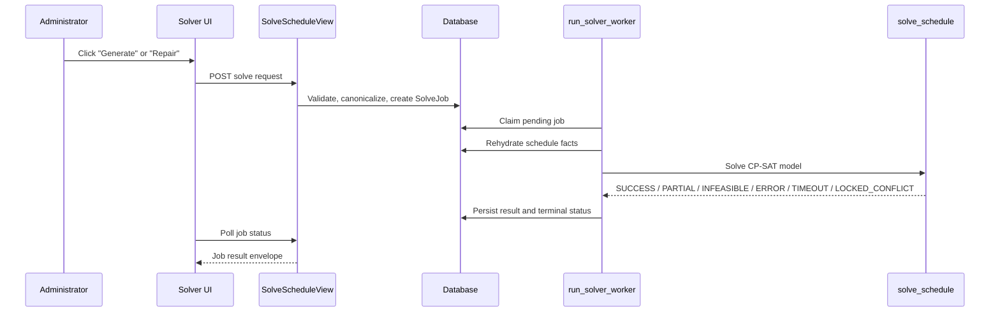

# Feature Context: Admissions Solver

## 1. Executive summary

**Confirmed:** the solver is the admissions interview scheduler’s CP-SAT model. It takes a canonicalized snapshot of candidates, interviewers, open slots, blocks, locked assignments, and solver options, then returns either a complete or partial interview plan. The solver lives in `admissions/admissions/solve_schedule.py`, is invoked asynchronously through `SolveJob`, and is exposed to administrators through `/admin/admission/<slug>/solve-schedule/`.

**Confirmed:** the current checkout is branch `distribute-interviews` in the active `/Users/viljen/dev/verv/webkom/admissions` worktree, with many local uncommitted changes. This brief describes the solver behavior in that worktree, not `master`.

**Confirmed:** the solver is not “just” a single rule set. It first enforces hard feasibility constraints, then optimizes a weighted objective. The objective primarily maximizes placement, then prefers lower overtime, fewer consecutive interviewer blocks, better load balance, earlier/denser schedules, and, in repair mode, smaller changes from a previous plan.

**Inferred:** if you want to change the solver’s behavior, the main lever is usually not a new subsystem but a different balance of existing constraints, repair weights, or input canonicalization. The decisive constraint is that the server rehydrates authoritative data before solving in the normal production path.

**Unknown:** the desired product policy for future solver changes is not stated in the repository. In particular, it is unclear whether the long-term intent is to keep `same_panel_per_block` relaxed in repair mode, whether publication should remain draft-like, and how much solve latency is acceptable at production scale.

## 2. Requested feature or problem

**Explicit request:** explain the logic behind the solver and what it takes into account.

**Implied request:** describe the real behavior from repository evidence, not a generic scheduling explanation.

**Plausible interpretations:** the user could mean only the CP-SAT model, the solve request/worker pipeline, or the entire scheduler surface. This brief focuses on the solver itself and the narrow surrounding pipeline that feeds it.

**Out of scope here:** admission creation, application review, publication semantics, name disclosure, and interview status workflows are adjacent systems, but they are not part of the solver’s scoring logic.

## 3. Project and architecture context

The stack is Django + Django REST Framework on the backend and React + TypeScript on the frontend. The solver is OR-Tools CP-SAT. Solver work is asynchronous: the HTTP endpoint creates a `SolveJob`, and a management command (`run_solver_worker`) claims and executes it.

Compact map:

```text
admissions/admissions/solve_schedule.py        CP-SAT model, constraints, objective, result shaping
admissions/admissions/schedule_validation.py   Canonicalizes DB state into solver input
admissions/admissions/solve_views.py           HTTP endpoint for enqueue/status/cancel
admissions/admissions/solve_jobs.py            Request construction and queue helpers
admissions/utils/management/commands/run_solver_worker.py  Worker loop and rehydration
admissions/admissions/serializers.py           Solver option schema and response serializers
frontend/src/components/Scheduling/Solver/     Solver UI, presets, repair preview, polling
admissions/admissions/tests/test_solver_quality.py        Model-level behavior tests
admissions/admissions/tests/test_api.py        Endpoint-level solver behavior tests
admissions/admissions/tests/test_schedule_api_hardening.py Rehydration, stale-baseline, job lifecycle tests
```

## 4. Current user and system behavior

An admission administrator opens the schedule page, configures panel size and solver options, and clicks generate. The frontend can either ask for a fresh initial plan or a repair-style rerun against an existing draft.

The server does not trust the browser to provide the real scheduling facts. In the normal production path, it rehydrates candidates, interviewers, availability, conflicts, and the previous schedule from the database before the worker solves.

The solver then considers:

- which candidates are active in the admission,
- which interviewers are eligible committee members,
- each interviewer’s submitted availability,
- interviewer-to-candidate conflicts,
- locked assignments from the current draft,
- the configured open slots and block layout,
- gender data when same-gender matching is enabled,
- the selected planning or repair strategy,
- and the previous schedule when a warm start or repair preview exists.

Alternative flows:

- If no open slots remain, the solver reports `INFEASIBLE`.
- If the locked rows contradict each other or the hard rules, it returns `LOCKED_CONFLICT` before optimization.
- If the model would be too large to build safely, it returns `ERROR` instead of risking a worker blow-up.
- If the search times out, the result is `TIMEOUT`, and the previous plan remains the safe fallback in the UI.

## 5. End-to-end execution flow

1. The administrator clicks solve in the solver UI.
2. The frontend builds a request from the current draft, locked rows, panel size, and solver options.
3. `SolveScheduleView.post` checks authentication, interview-admin authorization, and request shape.
4. For normal production traffic, `canonicalize_solver_payload()` replaces browser-supplied names and availability with current database facts.
5. `build_solve_request()` stores a compact request payload on a new `SolveJob`.
6. `run_solver_worker` claims the job, rehydrates the authoritative state again, and calls `solve_schedule()`.
7. `solve_schedule()` builds the CP-SAT model, applies hard constraints, and minimizes the weighted objective.
8. The worker writes the result back as `DONE`, `ERROR`, or cancellation-relevant state.
9. The frontend polls job status and shows success, partial success, infeasible, timeout, locked-conflict, or error feedback.
10. The administrator may then save the resulting draft schedule, adjust it manually, or rerun the solver with a different strategy.



## 6. Relevant files and symbols

| File | Symbol or section | Role | Why it matters |
| --- | --- | --- | --- |
| `admissions/admissions/solve_schedule.py` | `solve_schedule`, `SolveOptions`, `locked_conflict`, objective blocks | Core solver | This is the actual optimization logic and the best source for “what does it take into account?”. |
| `admissions/admissions/schedule_validation.py` | `canonicalize_solver_payload`, `canonicalize_schedule`, `build_solver_blocks` | Input canonicalization | Converts DB truth into solver-ready candidates, interviewers, slots, blocks, and locks. |
| `admissions/admissions/solve_views.py` | `SolveScheduleView.post`, `SolveJobStatusView` | HTTP adapter | Defines authorization, stale-baseline checks, and job enqueue/status behavior. |
| `admissions/admissions/solve_jobs.py` | `build_solve_request`, `enqueue_solve_job`, `cancel_solve_job` | Queue plumbing | Shows what is persisted for the worker and how concurrent requests collapse to one active job. |
| `admissions/utils/management/commands/run_solver_worker.py` | `Command._run`, `_claim_and_run`, `_write_back` | Background execution | Rehydrates data, handles retries, and persists solver outcomes. |
| `admissions/admissions/models.py` | `SavedSchedule`, `InterviewAvailability`, `SolveJob` | State model | Defines the persisted inputs and job lifecycle the solver works against. |
| `admissions/admissions/serializers.py` | `SolveOptionsSerializer`, `ScheduleRequestsSerializer`, `SolveJobSerializer` | API contract | Exposes the supported options, bounds, and response shape. |
| `admissions/admissions/tests/test_solver_quality.py` | solver behavior tests | Behavioral proof | Locks in the intended ranking between placement, overtime, continuity, blocks, and repairs. |
| `admissions/admissions/tests/test_api.py` | solve endpoint tests | Endpoint proof | Confirms overtime, same-gender, locked rows, continuity, and partial-result behavior. |
| `admissions/admissions/tests/test_schedule_api_hardening.py` | rehydration/stale-baseline/job tests | Safety proof | Confirms server-side rehydration and repair-preview freshness checks. |
| `frontend/src/components/Scheduling/Solver/solverHelpers.ts` | defaults, presets, messages | UI-facing options | Shows the user-facing names for the same weights and toggles the backend accepts. |
| `frontend/src/components/Scheduling/Solver/SolverSetupPanel.tsx` | generation/customization controls | UX surface | Exposes which solver knobs are meant to be primary vs advanced. |
| `frontend/src/components/Scheduling/Solver/useSolverSession.ts` | request assembly and draft tracking | Client orchestration | Builds solve requests, locked assignments, and repair mode calls from the current draft. |

## 7. Data model and state

The solver works over a mix of persisted and derived state.

Persisted state:

- `SavedSchedule` owns the canonical schedule/config snapshot for an admission.
- `InterviewAvailability` stores a committee member’s selected slots, conflicts, and reviewed candidate IDs.
- `SolveJob` stores the queued request, status, timestamps, result, and error text.

Derived or ephemeral state:

- solver candidates and interviewers after canonicalization,
- `all_slots` derived from the saved schedule,
- block groupings derived from `start_date`, `end_date`, `session_duration`, `chunk_size`, and `chunk_break_minutes`,
- `locked_assignments` extracted from the current draft,
- `previous_schedule` used as a warm start or repair baseline,
- frontend progress/draft state.

Important invariants:

- one active solve job per admission,
- one interview per candidate in the returned schedule,
- one candidate per time slot,
- panel size must match the configured size,
- candidate self-interviews are rejected,
- duplicate panel members are rejected,
- locked rows must remain valid,
- the result envelope always uses the same top-level status/result structure.

Shape-wise, the solver input is effectively:

```json
{
  "candidates": [{"id": "...", "name": "...", "gender": "M|F|"}],
  "interviewers": [{"id": "...", "name": "...", "gender": "M|F|", "availability": [0], "biased": ["..."]}],
  "all_slots": [0, 60, 120],
  "blocks": [[0, 60], [120, 180]],
  "locked_assignments": [{"candidate_id": "...", "time": 60, "panel": [{"id": "..."}]}]
}
```

In production, the browser does not supply authoritative names or availability for solving; the worker rehydrates those from the database.

## 8. API and interface contracts

### `POST /solve-schedule/`

Definition: enqueue a solve job for an admission.

Consumers: solver UI, repair preview flows, tests.

Input: `admission_slug`, candidate/interviewer IDs, panel size, `options`, optional `locked_assignments`, optional `baseline_updated_at`.

Output: `202 Accepted` with `SolveJobSerializer` data, or an existing active job if one already exists.

Validation and errors:

- `403` for non-admins,
- `400` for invalid payloads or missing saved schedule,
- `409` if `baseline_updated_at` is stale,
- `202` when accepted.

Side effects: creates or reuses one active `SolveJob`.

### `GET /solve-jobs/<id>/`

Definition: fetch job status.

Consumers: polling UI.

Output: job status, timestamps, result, and error.

Permissions: interview admins for that admission only.

### `DELETE /solve-jobs/<id>/`

Definition: cancel an active solve job.

Side effects: marks active job as cancelled and clears its request data/result.

### `SolveOptionsSerializer`

Relevant fields:

- `enforce_same_gender` defaults false,
- `allow_overtime` defaults true,
- `prioritize_continuity` defaults true,
- `same_panel_per_block` defaults true,
- `avoid_consecutive_interviewer_blocks` defaults true,
- `initial_strategy` choices: `balanced`, `minimize_overtime`, `balance_workload`,
- `repair_strategy` choices: `minimum_change`, `preserve_panels`, `balanced`,
- `repair_mode` defaults false,
- `overtime_weight`, `load_balance_weight`, `continuity_weight`, `max_solver_seconds`.

Compatibility risk: frontend and backend must keep these names and option semantics aligned, especially for repair mode and the strategy presets.

## 9. Existing analogous implementations

`schedule_validation.py` is the closest analogue for authoritative schedule rules. It already canonicalizes rows, enforces hard validation, and knows when `same_panel_per_block` and `same-gender` rules should be checked.

`run_solver_worker.py` is the closest analogue for robust long-lived background execution. It already handles stale jobs, recovery from transient database errors, and bounded write-back retries.

`frontend/src/components/Scheduling/Solver/repairScenarios.ts` is the closest analogue for repair comparisons. It measures what changed in candidate times, interviewer panels, overtime, and block stability.

`frontend/src/components/Scheduling/Solver/SolverSetupPanel.tsx` is the closest analogue for user-facing solver configuration. It maps the solver into accessible presets instead of exposing every weight by default.

Recommended reuse:

- reuse the canonicalization and repair-baseline patterns,
- reuse the job lifecycle and polling model,
- reuse the existing strategy preset vocabulary.

Not recommended:

- inventing a second source of truth for solver state,
- pushing solver authority into the frontend,
- treating repair mode as a completely separate product path.

## 10. Business rules and constraints

**Confirmed hard constraints**

- only interview admins can solve,
- a candidate can appear at most once,
- a time slot can host at most one candidate,
- panel size is exact,
- duplicate panel members are invalid,
- self-interviews are invalid,
- locked rows are validated before solving,
- a stale baseline is rejected,
- the model refuses instances larger than the configured variable bound.

**Confirmed soft preferences**

- place as many candidates as possible first,
- prefer lower overtime,
- prefer better load balance,
- prefer earlier/denser schedules,
- prefer fewer consecutive blocks for the same interviewer,
- prefer continuity around existing occupied runs,
- in repair mode, prefer fewer changes from the previous plan.

**Existing conventions**

- `initial_strategy` changes the overtime/load weights rather than replacing the objective,
- `repair_strategy` changes the penalty profile rather than creating a different solver,
- same-gender is only meaningful when actual interviewer gender data exists,
- a lock from a previous solve should survive reruns unless it now violates a hard rule.

**Unknown product decisions**

- whether future policy should make any current soft preference hard,
- whether repair mode should continue to relax `same_panel_per_block`,
- whether the current balance between overtime and workload is the desired long-term default.

## 11. Testing and validation

Relevant tests:

- `admissions/admissions/tests/test_solver_quality.py` covers placement, partial results, no-open-slot infeasibility, same-gender, overtime, continuity, block behavior, locked rows, deterministic ties, and repair strategy differences.
- `admissions/admissions/tests/test_api.py` covers the solve endpoint’s contract and confirms overtime and same-gender options behave as expected.
- `admissions/admissions/tests/test_schedule_api_hardening.py` covers server-side rehydration, stale-baseline rejection, and solve-job lifecycle behavior.
- `admissions/admissions/tests/test_worker_resilience.py` covers worker claim/write-back resilience.

Commands run for this investigation:

- `git status --short`
- `git branch --show-current`
- `git log --oneline -n 8 -- admissions/admissions/solve_schedule.py admissions/admissions/schedule_validation.py admissions/admissions/solve_views.py admissions/admissions/tests/test_solver_quality.py`
- multiple `sed`, `nl`, and `rg` inspections over the files listed above

Commands not run:

- no Django test command,
- no frontend typecheck,
- no application startup.

Recommended validation if the solver logic changes:

- `python manage.py test admissions.admissions.tests.test_solver_quality admissions.admissions.tests.test_api admissions.admissions.tests.test_schedule_api_hardening admissions.admissions.tests.test_worker_resilience`
- `yarn types`

## 12. Performance, security, and operational considerations

Performance:

- CP-SAT complexity grows quickly with candidates × slots × interviewers.
- The code uses an explicit variable-count guard because the solver time limit does not cover model construction.
- The worker keeps the heavy work off the request thread.

Security and privacy:

- the browser must not be trusted with authoritative candidate or interviewer facts,
- solve requests are admin-only,
- interviewer conflicts, availability, and candidate identity are sensitive,
- rehydration is important because it strips spoofed client data from the real request.

Concurrency and idempotency:

- the queue enforces one active solve per admission,
- duplicate concurrent requests converge on the same active job,
- cancellation must win over late write-back,
- the worker is designed to survive transient DB failures.

Observability and operations:

- job status and timestamps are persisted,
- stale pending/running jobs are reaped into `ERROR`,
- finished jobs are retained only for a bounded time.

## 13. Likely change surface

If the solver logic changes, the likely touch points are:

- `admissions/admissions/solve_schedule.py`
- `admissions/admissions/schedule_validation.py`
- `admissions/admissions/solve_views.py`
- `admissions/admissions/solve_jobs.py`
- `admissions/utils/management/commands/run_solver_worker.py`
- `admissions/admissions/serializers.py`
- `frontend/src/components/Scheduling/Solver/solverHelpers.ts`
- `frontend/src/components/Scheduling/Solver/SolverSetupPanel.tsx`
- `frontend/src/components/Scheduling/Solver/useSolverSession.ts`
- `frontend/src/components/Scheduling/Solver/SolverView.tsx`
- the solver tests listed above

Stable contracts to preserve:

- the response envelope (`status`, `schedule`, `unplaceable`, `locked_conflicts`, optional `error`/`optimal`),
- the active-job uniqueness rule,
- server-side rehydration in the normal path,
- locked-row preservation,
- the distinction between initial planning and repair mode.

## 14. Candidate solution directions

These are not implementation recommendations for this turn, just the technically plausible directions already implied by the code:

1. **Tune the existing weights.**  
   Core idea: adjust `overtime_weight`, `load_balance_weight`, `continuity_weight`, or the repair profile penalties.  
   Fit: best when the solver behavior is basically right but the ranking between good answers should shift.  
   Risk: can subtly change many outputs at once.

2. **Add a hard rule.**  
   Core idea: convert a currently soft preference into a hard constraint in `solve_schedule.py` and validation.  
   Fit: appropriate when the business wants a strict guarantee.  
   Risk: can turn solvable cases into `PARTIAL`, `INFEASIBLE`, or `LOCKED_CONFLICT`.

3. **Change repair semantics.**  
   Core idea: modify `repair_mode` or the repair profiles so the solver protects a different kind of stability.  
   Fit: appropriate when reruns should minimize edits more aggressively or preserve panels more strongly.  
   Risk: may conflict with the initial-planning objective and user expectations.

4. **Change canonicalization, not the model.**  
   Core idea: alter which DB facts become solver input, for example availability normalization or lock validation.  
   Fit: appropriate when the issue is bad input, not bad optimization.  
   Risk: changes behavior before the solver even runs.

## 15. Open questions

### Blocking

- What exact question is the user asking about the solver: “how does it choose?”, “what constraints are hard?”, or “what would need to change to alter the output”? The answer changes the emphasis of a future follow-up.

### Important

- Should `same_panel_per_block` remain relaxed in repair mode, or should repair mode eventually preserve it as a hard rule?
- Should the current overtime-vs-load balance presets remain the default, or should `minimize_overtime` become more aggressive?
- Should same-gender remain conditional on usable gender data, or should missing gender data be treated as a block instead of a skip?
- Should the solver continue to prefer continuity and shorter occupied runs, or should it favor a different compactness heuristic?

### Optional

- Would the product benefit from exposing the weighted objective breakdown to administrators?
- Should repair previews surface a more explicit explanation of why a specific candidate was left unplaced?

## 16. Recommended next investigation steps

- If the user wants a deeper “why did this candidate land here?” explanation, inspect a concrete `SolveJob.result` and trace it back through the objective terms.
- If the user wants a change proposal, compare the current weights against the desired scheduling policy and decide which preference should dominate when they conflict.
- If the user wants UI clarity, inspect the solver setup presets and the repair preview screens together with the backend tests.
- If the user wants production confidence, run the focused solver/test commands listed above in an environment with Django and the database available.

## 17. Evidence appendix

```text
[admissions/admissions/solve_schedule.py — solve_schedule]

"Placement dominates every other objective"

Why it matters:
This is the core answer to what the solver cares about first. It maximizes placement before any secondary preference.
```

```text
[admissions/admissions/solve_schedule.py — solve_schedule]

"allow_overtime", "prioritize_continuity", "same_panel_per_block"

Why it matters:
These are the main user-facing toggles that change the model.
```

```text
[admissions/admissions/schedule_validation.py — canonicalize_solver_payload]

"Kandidatlisten samsvarer ikke med det aktive opptaket."

Why it matters:
The solver input is canonicalized from the live admission, not blindly accepted from the browser.
```

```text
[admissions/admissions/solve_views.py — SolveScheduleView.post]

"The actual solving runs in run_solver_worker"

Why it matters:
The request only enqueues work; the worker owns the actual solve lifecycle.
```

```text
[admissions/admissions/tests/test_solver_quality.py — test_repair_strategies_choose_substitute_or_whole_block]

"minimum_change", "preserve_panels"

Why it matters:
The tests confirm that repair mode is a distinct objective profile, not just a renamed initial solve.
```

```text
[admissions/admissions/tests/test_api.py — test_overtime_can_be_enabled]

"any(member["is_overtime"] for member in res.data["schedule"][0]["panel"])"

Why it matters:
The result explicitly marks overtime members, so overtime is part of the observable contract.
```

## 18. External-model handoff

### What you should assume

- The solver is the admissions interview scheduler’s CP-SAT engine, not a generic route-level feature.
- Hard rules are enforced before optimization.
- The server canonicalizes normal solve requests from the database.
- Repair mode is a real alternate objective profile.

### What you should not assume

- Do not assume the browser-supplied names, availability, or conflicts are authoritative in production.
- Do not assume same-gender checking always runs; the code skips it if there is no usable gender data.
- Do not assume repair mode uses the exact same objective as initial planning.
- Do not assume the current weights are product-final; they are implementation choices.

### Decisions you are being asked to make

- If you are changing the solver, decide whether the desired behavior is a weight tweak, a new hard rule, a canonicalization change, or a repair-policy change.
- If you are explaining the solver to a user, decide whether to lead with constraints, optimization ranking, or the visible UI presets.
- If you are evolving the product, decide whether repair mode should keep relaxing panel continuity or preserve it strictly.

### Most relevant evidence

- `admissions/admissions/solve_schedule.py`
- `admissions/admissions/schedule_validation.py`
- `admissions/admissions/solve_views.py`
- `admissions/utils/management/commands/run_solver_worker.py`
- `admissions/admissions/tests/test_solver_quality.py`
- `admissions/admissions/tests/test_api.py`

